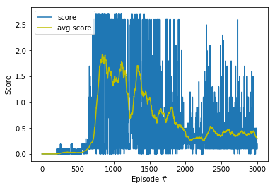

# Report on Project 3 Collaboration and Competition

In this project, the Deep deterministic Policy Gradients(DDPG) algorithm has been used for solving the environments.

The report is describing the learning algorithm with used hyper parameters, the arcitectures and contains experiment results.

- The first step I have taken is to bring DDPG codes which is provided by DRLND into my workspace. 
- The second step is to amend the code in order to work for multiple agents,ie, a pair of angents
- The third step is to understand how the model work as hyper parameters change and find out the basic hyper parameters that meet the condition of solving environments.
- The final step is to iterate experiments in order to find out the best fit models that achieve high performance.

## DDPG Algorithms

The algorithm of DDPG was introduced [in this paper](https://arxiv.org/pdf/1509.02971.pdf),
Continuous Control with Deep Reinforcement Learning, by researchers at Google Deepmind. 
In this paper, the authors present "a model-free, off-policy actor-critic algorithm using deep function approximators that can learn policies in high-dimensional, continuous action spaces." 

Deep Deterministic Policy Gradient (DDPG) is an algorithm which concurrently learns a Q-function and a policy. 
It uses off-policy data and the Bellman equation to learn the Q-function, and uses the Q-function to learn the policy.

You can refer to the follwoing for detail explanation about DDPG algorithms
- [OpenAI Deep Deterministic Policy Gradient](https://spinningup.openai.com/en/latest/algorithms/ddpg.html)
- [Deep Deterministic Policy Gradients Explained](https://towardsdatascience.com/deep-deterministic-policy-gradients-explained-2d94655a9b7b)
- [DDPG Algorithm](http://www.cs.sjsu.edu/faculty/pollett/masters/Semesters/Spring18/ujjawal/DDPG-Algorithm.pdf)

### Hyper Parameters
- DDPG Agents
~~~python
BUFFER_SIZE = int(1e5)  # replay buffer size
BATCH_SIZE = 128        # minibatch size
GAMMA = 0.99            # discount factor
TAU = 3e-3              # for soft update of target parameters
LR_ACTOR = 1e-3         # learning rate of the actor 
LR_CRITIC = 1e-4        # learning rate of the critic
WEIGHT_DECAY = 0.0      # L2 weight decay

Ornstein-Uhlenbeck noise parameters (0.15 theta and 0.1 sigma.)
~~~

In this model, the most interesting hyper parameter is TAU value which is used for soft updates. 
As the TAU value increases, the average score quickly reaches the Threshold value.  
On the other hand, it can also affect the descending speed of its value after reaching the peak. 
After serverl trials, set **3e-3** to TAU value. It's not too fast and too slow.

- Actor-Critic Models
~~~python

class Actor(nn.Module):
    """Actor (Policy) Model."""

    def __init__(self, state_size, action_size, seed, fc1_units=128, fc2_units=256):
        """Initialize parameters and build model.
        Params
        ======
            state_size (int): Dimension of each state
            action_size (int): Dimension of each action
            seed (int): Random seed
            fc1_units (int): Number of nodes in first hidden layer
            fc2_units (int): Number of nodes in second hidden layer
        """
        super(Actor, self).__init__()
        self.seed = torch.manual_seed(seed)
        self.fc1 = nn.Linear(state_size, fc1_units)
        self.fc2 = nn.Linear(fc1_units, fc2_units)
        self.fc3 = nn.Linear(fc2_units, action_size)
        self.bn1 = nn.BatchNorm1d(fc1_units)
        self.reset_parameters()
...
...
    def forward(self, state):
        """Build an actor (policy) network that maps states -> actions."""
        if state.dim() == 1:
            state = torch.unsqueeze(state,0)
        x = F.relu(self.bn1(self.fc1(state)))
        #x = F.relu(self.fc1(state))
        x = F.relu(self.fc2(x))
        return F.tanh(self.fc3(x))

class Critic(nn.Module):
    """Critic (Value) Model."""

    def __init__(self, state_size, action_size, seed, fcs1_units=128, fc2_units=256):
        """Initialize parameters and build model.
        Params
        ======
            state_size (int): Dimension of each state
            action_size (int): Dimension of each action
            seed (int): Random seed
            fcs1_units (int): Number of nodes in the first hidden layer
            fc2_units (int): Number of nodes in the second hidden layer
        """
        super(Critic, self).__init__()
        self.seed = torch.manual_seed(seed)
        self.fcs1 = nn.Linear(state_size, fcs1_units)
        self.bn1 = nn.BatchNorm1d(fcs1_units)
        self.fc2 = nn.Linear(fcs1_units+action_size, fc2_units)
        self.fc3 = nn.Linear(fc2_units, 1)
        self.reset_parameters()
...
...

    def forward(self, state, action):
        """Build a critic (value) network that maps (state, action) pairs -> Q-values."""
        if state.dim() == 1:
            state = torch.unsqueeze(state,0)
        xs = F.relu(self.bn1(self.fcs1(state)))
        #xs = F.relu(self.fcs1(state))
        x = torch.cat((xs, action), dim=1)
        x = F.relu(self.fc2(x))
        return self.fc3(x)
~~~
As you can see in the above code snippets, the number of units of hiddenl layers 1,2 is 128, 256 in Actor and Critic Networks. 
Also, the batch normalization was inserted after the first hidden layer, this is also a key to get a reward as quickly as possible. 
If you set the unit size of hidden layers more than 256 in my experiments, for example, 256,512, it was very hard to get a score within 1000 episode.

## Experiment Results

**Examine the State and Action Spaces**
~~~python
Number of agents: 2
Size of each action: 2
There are 2 agents. Each observes a state with length: 24
The state for the first agent looks like: [ 0.          0.          0.          0.          0.          0.
  0.          0.          0.          0.          0.          0.
  0.          0.          0.          0.         -6.65278625 -1.5
 -0.          0.          6.83172083  6.         -0.          0.        ]
 ~~~

**Average Score per Episodes**

I have repeated episodes 3000 times with max time step 1000. 
The Agent solved the environment in 734 episoode with average score 0.5073

~~~python
Episode 100	Average Score: 0.0000
Episode 200	Average Score: 0.0000
Episode 300	Average Score: 0.0298
Episode 400	Average Score: 0.0281
Episode 500	Average Score: 0.0284
Episode 600	Average Score: 0.0633
Episode 700	Average Score: 0.2299
Episode 734	Average Score: 0.5073
Environment solved in 734 episodes!	Average Score: 0.5073
Episode 800	Average Score: 1.5889
Episode 900	Average Score: 1.6570
Episode 1000	Average Score: 1.3845
Episode 1100	Average Score: 1.6619
Episode 1200	Average Score: 1.1228
Episode 1300	Average Score: 1.2341
Episode 1400	Average Score: 1.1707
Episode 1500	Average Score: 1.0808
Episode 1600	Average Score: 0.6444
Episode 1700	Average Score: 0.7851
Episode 1800	Average Score: 0.9016
Episode 1900	Average Score: 0.5076
Episode 2000	Average Score: 0.4260
Episode 2100	Average Score: 0.2863
Episode 2200	Average Score: 0.3154
Episode 2300	Average Score: 0.3765
Episode 2400	Average Score: 0.4357
Episode 2500	Average Score: 0.3468
Episode 2600	Average Score: 0.4799
Episode 2700	Average Score: 0.3588
Episode 2800	Average Score: 0.4167
Episode 2900	Average Score: 0.4024
Episode 3000	Average Score: 0.2967
~~~

The following is a plot of scores of each episode and average score over 100 episodes. 
Also, it hit the peak at 841 th episode with score 1.93

## Future Works
- Find out the best hyper parameters which can meet the performance and also reduce training time
- Tune algorithms to be more stable.
- Try Other Algorithms for better perfomance such as [Trust Region Policy Optimization (TRPO)](https://arxiv.org/abs/1502.05477) and Truncated Natural Policy Gradient (TNPG) and [Proximal Policy Optimization (PPO)](https://arxiv.org/abs/1707.06347). Also explore the recent [Distributed Distributional Deterministic Policy Gradients (D4PG](https://openreview.net/forum?id=SyZipzbCb) algorithm as another method for adapting DDPG for continuous control.

## Suggestions and Comments from review
You may consider the following parameters below to achieve with even better results:

- Try increasing the batch_size to 1024.
- Try calling the method less frequently (say 5 times every 5-10 timesteps so that more data is collected)
- Try decreasing your hidden units to 128 and 64 with LeakyReLU() activation on both layers.
- Use batch normalization for fully connected layer

Here are some ideas to improve the agent’s performance:

- Implementing the [Prioritized Experience Replay](https://arxiv.org/abs/1511.05952) for the DDPG and compare the current results.
- Implementing and using better RL algorithm such as [D4PG](https://openreview.net/forum?id=SyZipzbCb&noteId=SyZipzbCb).

Some ideas and improvement to speed up the learning and therefore, more time to improve the agents performance are:

- Writing and using a framework, which can be used for an automatized, simplified and faster hyperparameter search.
    - This framework can include for instance and do not be limited to:
        - [Grid Search](https://medium.com/@elutins/grid-searching-in-machine-learning-quick-explanation-and-python-implementation-550552200596)
        - [Random Search](https://en.wikipedia.org/wiki/Random_search)
        - [Bayesian Optimisation](https://towardsdatascience.com/an-introductory-example-of-bayesian-optimization-in-python-with-hyperopt-aae40fff4ff0)
    - Run multiple scripts with different parameter in parallel to reduce the hyperparameter search time.
- Optimise the DDPG algorithm with [replay buffer](https://arxiv.org/abs/1712.01275) and code by:
    - Using [vectorized commands](https://www.cs.utah.edu/~germain/PPS/Topics/Matlab/vectorized_or_array_operations.html) where possible instead of for loops
    - Parallelisation and synchronisation of the sampling and learning.
        - One process can sample a few episodes while the other process can perform the learning.

## Extra Material

You might be interested on the following algorithm and topics about Reinforcement Learning that can also be used to solve the environment:

- [Multi-Agent Actor-Critic for Mixed Cooperative-Competitive Environments](https://arxiv.org/pdf/1706.02275.pdf)
- [Simple Reinforcement Learning: Asynchronous Actor-Critic Agents (A3C)](https://medium.com/emergent-future/simple-reinforcement-learning-with-tensorflow-part-8-asynchronous-actor-critic-agents-a3c-c88f72a5e9f2)
- [RL — Proximal Policy Optimization (PPO)](https://medium.com/@jonathan_hui/rl-proximal-policy-optimization-ppo-explained-77f014ec3f12)
- [Mean Field Multi-Agent Reinforcement Learning](https://arxiv.org/pdf/1802.05438.pdf)
- [OpenAI Five](https://blog.openai.com/openai-five/)
- [Curiosity-driven Exploration by Self-supervised Prediction](https://pathak22.github.io/noreward-rl/)
